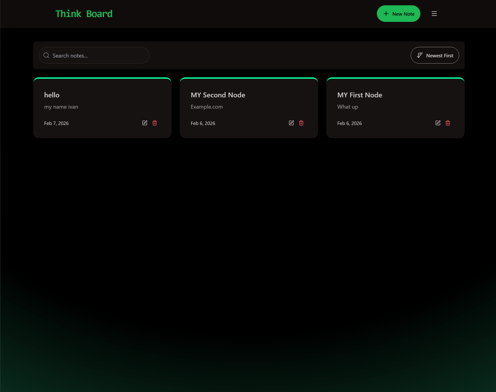
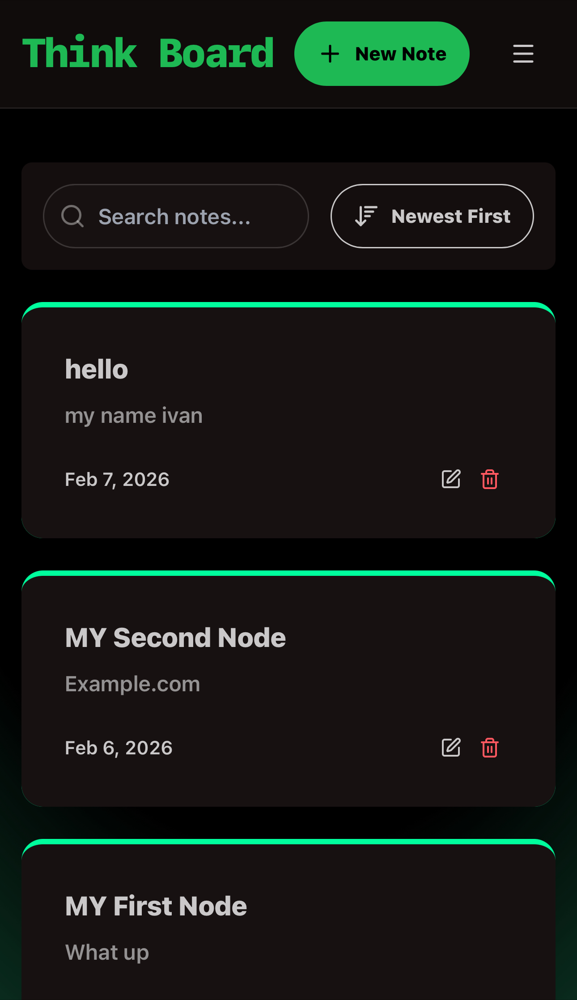
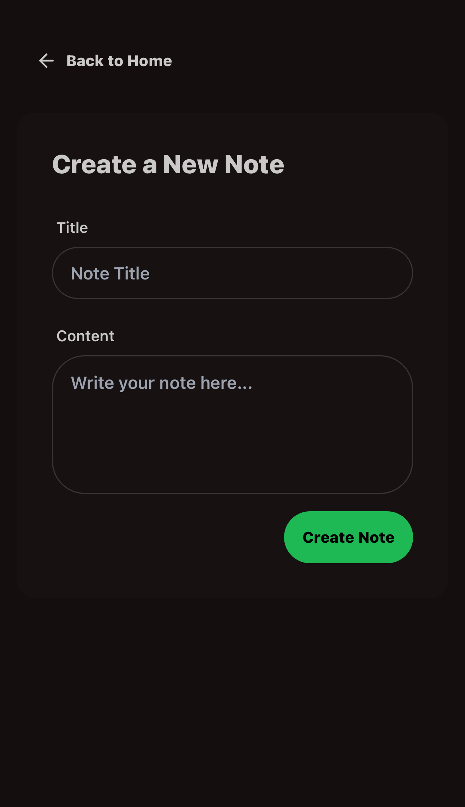
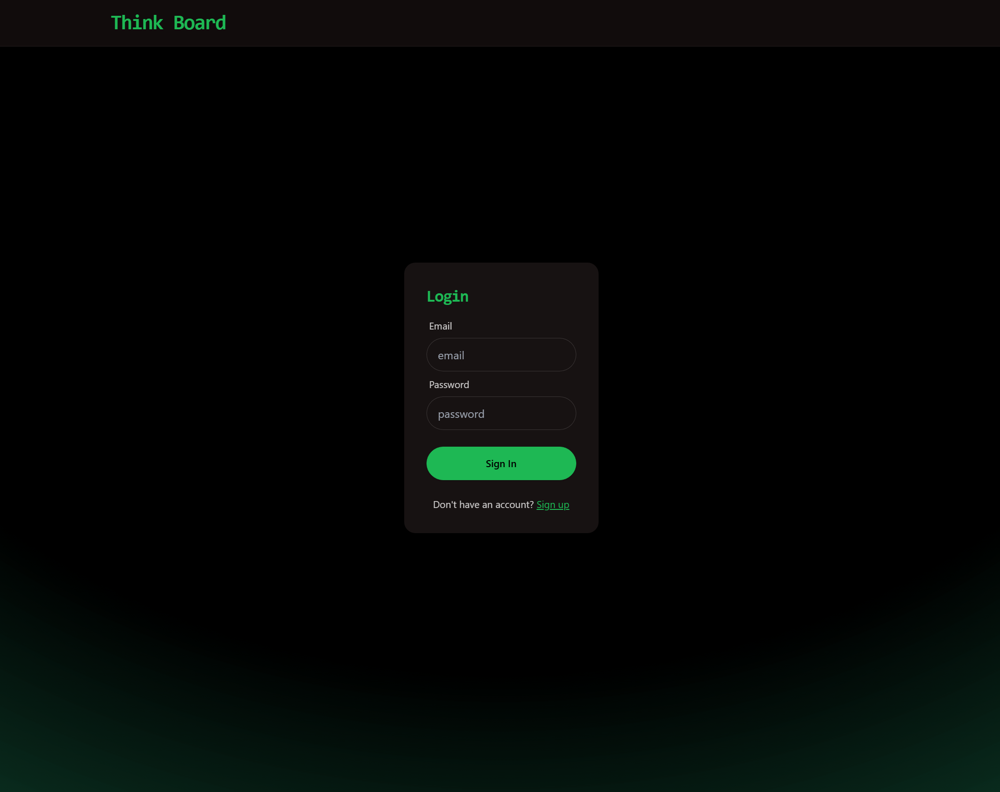
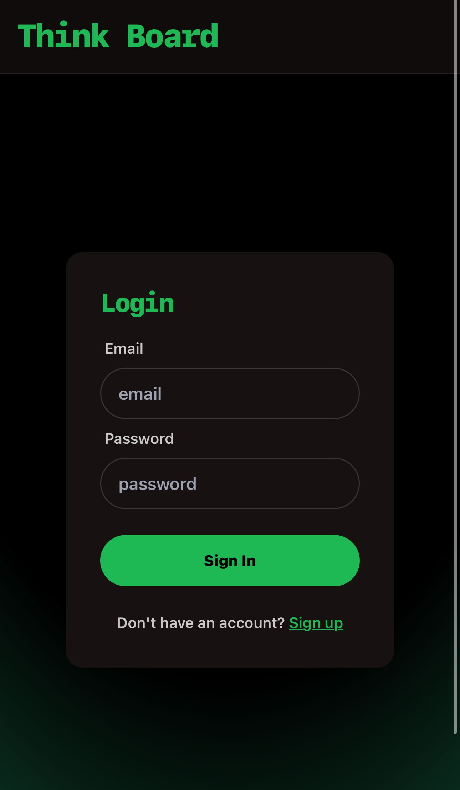

# 📝 MERN Thinkboard

A full-stack authenticated note-taking application built with the MERN stack (MongoDB, Express, React, Node.js). Securely create, manage, and organize your personal notes with JWT authentication, protected routes, and a clean modern interface powered by TailwindCSS and DaisyUI.

     

## 🌐 Live Demo

**[View Live Application](https://mern-thinkboard-qsrl.onrender.com)**

> Note: The app is hosted on Render's free tier. Initial load may take 30-60 seconds as the server spins up from sleep mode.

---

## ✨ Features

- **🔐 JWT Authentication** - Secure user authentication with JSON Web Tokens (7-day expiration)
- **👤 User Accounts** - Register, login, and manage personal accounts with password hashing (bcrypt)
- **🔒 Protected Routes** - Frontend and backend route protection ensuring only authenticated users can access their notes
- **📝 User-Specific Notes** - Each user's notes are private and isolated from other users
- **� Search & Sort** - Real-time search by title/content and sort by date or alphabetically
- **�🔌 RESTful API** - Full CRUD functionality with proper HTTP methods and status codes
- **🎨 Modern UI/UX** - Clean, responsive design with TailwindCSS and DaisyUI
- **🚀 Real-time Updates** - Instant feedback with toast notifications
- **🛡️ Smart Rate Limiting** - IP-based rate limiting for auth routes, user-based for protected routes using Upstash Redis
- **📱 Responsive Design** - Works perfectly on desktop, tablet, and mobile devices
- **⚡ Fast Performance** - Optimized backend with MongoDB indexing
- **✅ Input Validation** - Client and server-side validation for email, password, and username formats
- **🔄 Axios Interceptors** - Automatic token attachment to all authenticated requests

---

## 🛠️ Tech Stack

### Frontend

- **React 18** - Modern UI library with hooks
- **Vite** - Lightning-fast build tool and dev server
- **TailwindCSS** - Utility-first CSS framework
- **DaisyUI** - Beautiful component library
- **Axios** - HTTP client for API requests
- **React Hot Toast** - Elegant notification system
- **React Router** - Client-side routing

### Backend

- **Node.js** - JavaScript runtime
- **Express.js** - Web application framework
- **MongoDB** - NoSQL database
- **Mongoose** - MongoDB object modeling with schema validation
- **JWT (jsonwebtoken)** - Secure token-based authentication
- **bcryptjs** - Password hashing and verification
- **Upstash Redis** - Serverless Redis for rate limiting
- **CORS** - Cross-Origin Resource Sharing enabled
- **dotenv** - Environment variable management

---

## 📸 Screenshots

### 🖥️ Home Page with Search & Sort



*Features a responsive notes grid with real-time search functionality and multiple sorting options (Newest First, Oldest First, A-Z, Z-A). Each note card displays the title, preview text, date, and quick action buttons for editing and deleting.*

<div align="center">
  
  <p><em>Mobile View</em></p>
</div>

---

### ✏️ Create/Edit Note


*Clean editing interface with dedicated fields for title and content. Save changes instantly or delete notes with a single click. Navigate back to your notes list anytime.*

<div align="center">
  
  <p><em>Mobile View</em></p>
</div>

---

### 🔐 Login Page



*Secure authentication with email and password. New users can easily register through the sign-up link. All passwords are hashed with bcrypt and sessions managed with JWT tokens.*

<div align="center">
  
  <p><em>Mobile View</em></p>
</div>

---

## 🚀 Getting Started

### Prerequisites

- **Node.js** (v16 or higher)
- **MongoDB** account ([MongoDB Atlas](https://www.mongodb.com/cloud/atlas))
- **Upstash** account ([Upstash Redis](https://upstash.com/))
- **Postman** (optional, for API testing - [Download Postman](https://www.postman.com/))

### Installation

1. **Clone the repository**

   ```bash
   git clone https://github.com/yourusername/MERN-Thinkboard.git
   cd MERN-Thinkboard
   ```

2. **Install dependencies**
   ```bash
   npm install              # Installs root dependencies (concurrently for dev mode)
   cd backend && npm install
   cd ../frontend && npm install
   cd ..
   ```

### Environment Variables

Create a `.env` file in the `backend` directory:

```env
# MongoDB Connection
MONGO_URI=your_mongodb_connection_string

# JWT Secret (generate a secure random string)
JWT_SECRET=your_secure_random_64_character_hex_string

# Server Port
PORT=5001

# Node Environment
NODE_ENV=development

# Upstash Redis (for rate limiting)
UPSTASH_REDIS_REST_URL=your_upstash_redis_url
UPSTASH_REDIS_REST_TOKEN=your_upstash_redis_token
```

**Generate a secure JWT_SECRET:**

```bash
node -e "console.log(require('crypto').randomBytes(64).toString('hex'))"
```

### Running Locally

#### Option 1: Run Both (Frontend & Backend) Concurrently

```bash
npm run dev
```

#### Option 2: Run Separately

**Backend:**

```bash
cd backend
npm run dev
```

**Frontend:**

```bash
cd frontend
npm run dev
```

The app will be available at:

- **Frontend**: http://localhost:5173
- **Backend API**: http://localhost:5001

---

## 📦 Project Structure

```
MERN-Thinkboard/
├── backend/
│   ├── src/
│   │   ├── config/
│   │   │   ├── db.js                  # MongoDB connection
│   │   │   └── upstash.js             # Redis rate limiter config
│   │   ├── constants/
│   │   │   └── authMessages.js        # Auth error message constants
│   │   ├── controllers/
│   │   │   ├── authController.js      # Auth logic (register/login/logout)
│   │   │   └── notesController.js     # Business logic for notes
│   │   ├── middleware/
│   │   │   ├── auth.js                # JWT verification middleware
│   │   │   └── rateLimiter.js         # Rate limiting middleware
│   │   ├── models/
│   │   │   ├── Note.js                # Mongoose Note schema (with user ref)
│   │   │   └── Users.js               # Mongoose User schema
│   │   ├── routes/
│   │   │   ├── authRoutes.js          # Authentication routes
│   │   │   └── notesRoutes.js         # Protected notes routes
│   │   ├── utils/
│   │   │   ├── generateToken.js       # JWT token generation
│   │   │   └── validation.js          # Input validation helpers
│   │   └── server.js                  # Express app entry point
│   └── package.json
├── frontend/
│   ├── src/
│   │   ├── auth/
│   │   │   ├── GuestRoute.jsx         # Redirect authenticated users
│   │   │   └── ProtectedRoute.jsx     # Protect routes (require auth)
│   │   ├── components/
│   │   │   ├── LoginForm.jsx          # Login form component
│   │   │   ├── MinalNavbar.jsx        # Minimal navbar for auth pages
│   │   │   ├── NavBar.jsx             # Main navigation with logout
│   │   │   ├── NoteCard.jsx           # Individual note display
│   │   │   ├── NotesNotFound.jsx      # Empty state component
│   │   │   ├── RateLimitedUI.jsx      # Rate limit warning
│   │   │   ├── RegisterForm.jsx       # Registration form component
│   │   │   └── UtilityBar.jsx         # Search and sort controls
│   │   ├── lib/
│   │   │   ├── axios.js               # Axios instance with interceptors
│   │   │   └── utils.js               # Utility functions
│   │   ├── pages/
│   │   │   ├── CreatePage.jsx         # Create note page (protected)
│   │   │   ├── HomePage.jsx           # Main notes listing (protected)
│   │   │   ├── LoginPage.jsx          # Login page (guest only)
│   │   │   ├── NoteDetailPage.jsx     # View/Edit note (protected)
│   │   │   └── RegisterPage.jsx       # Registration page (guest only)
│   │   ├── App.jsx                    # Main app with route guards
│   │   ├── main.jsx                   # React entry point
│   │   └── index.css                  # Global styles
│   └── package.json
└── package.json                        # Root package.json
```

---

## 🔌 API Endpoints

### Authentication Routes (Public)

| Method | Endpoint             | Description              | Rate Limit |
| ------ | -------------------- | ------------------------ | ---------- |
| POST   | `/api/auth/register` | Register new user        | IP-based   |
| POST   | `/api/auth/login`    | Login user (returns JWT) | IP-based   |
| POST   | `/api/auth/logout`   | Logout user              | IP-based   |

**Request Body (Register):**

```json
{
  "userName": "johndoe",
  "email": "john@example.com",
  "password": "securepassword123"
}
```

**Request Body (Login):**

```json
{
  "email": "john@example.com",
  "password": "securepassword123"
}
```

**Response (Login/Register):**

```json
{
  "message": "Login successful",
  "token": "eyJhbGciOiJIUzI1NiIsInR5cCI6IkpXVCJ9...",
  "user": {
    "id": "507f1f77bcf86cd799439011",
    "userName": "johndoe",
    "email": "john@example.com"
  }
}
```

### Notes Routes (Protected - Requires JWT)

| Method | Endpoint         | Description             | Rate Limit |
| ------ | ---------------- | ----------------------- | ---------- |
| GET    | `/api/notes`     | Get all user's notes    | User-based |
| GET    | `/api/notes/:id` | Get specific note by ID | User-based |
| POST   | `/api/notes`     | Create a new note       | User-based |
| PUT    | `/api/notes/:id` | Update note by ID       | User-based |
| DELETE | `/api/notes/:id` | Delete note by ID       | User-based |

**Authentication Header:**

```
Authorization: Bearer <your_jwt_token>
```

**Note:** All notes routes require a valid JWT token in the Authorization header. Users can only access their own notes.

---

## 🚢 Deployment

This app is deployed on **Render** with the following configuration:

### Backend + Frontend Combined Deployment on Render

1. **Build Command:**

   ```bash
   npm install && npm run build
   ```

2. **Start Command:**

   ```bash
   npm run start
   ```

3. **Environment Variables:**
   - `MONGO_URI`
   - `JWT_SECRET`
   - `UPSTASH_REDIS_REST_URL`
   - `UPSTASH_REDIS_REST_TOKEN`
   - `PORT` (auto-set by Render)
   - `NODE_ENV=production`

---

## 🎯 Future Enhancements

- [ ] **Password Reset** - Email-based password recovery system
- [ ] **Profile Management** - Update username, email, and password
- [ ] **Note Categories/Tags** - Organize notes with tags
- [ ] **Rich Text Editor** - Markdown or WYSIWYG editor support
- [ ] **Dark Mode** - Theme toggle
- [ ] **Note Sharing** - Share notes via public links
- [ ] **Drag & Drop** - Reorder notes
- [ ] **File Attachments** - Upload images/files to notes
- [ ] **Two-Factor Authentication** - Enhanced security with 2FA
- [ ] **Pagination** - Load notes in batches for better performance

---

## 📄 License

This project is licensed under the **MIT License** - see the [LICENSE](LICENSE) file for details.

**TL;DR**: You can use, modify, and distribute this project freely with attribution.

---

## 👤 Author

**Ivan Tran**

- 💼 GitHub: [@IvanTran-2001](https://github.com/IvanTran-2001)
- 💼 LinkedIn: [Ivan Tran](https://linkedin.com/in/ivan-tran-76164017a)
- 🌐 Portfolio: [ivantran-2001.github.io](https://ivantran-2001.github.io/)
- 📧 Email: mystoganx2001@gmail.com

---

## 🙏 Acknowledgments

- Built as a full-stack learning project to develop professional skills in modern web development and authentication patterns
- Inspired by [this MERN Stack tutorial by As a Programmer](https://www.youtube.com/watch?v=F9gB5b4jgOI) - adapted and expanded with additional features like search/sort functionality and enhanced mobile responsiveness
- Thanks to the MERN stack community for excellent documentation and resources

---

## ⭐ Show Your Support

If you found this project helpful or learned something from it, please consider giving it a ⭐️ on GitHub!

---

**Made with ❤️ and ☕ by Ivan Tran**
